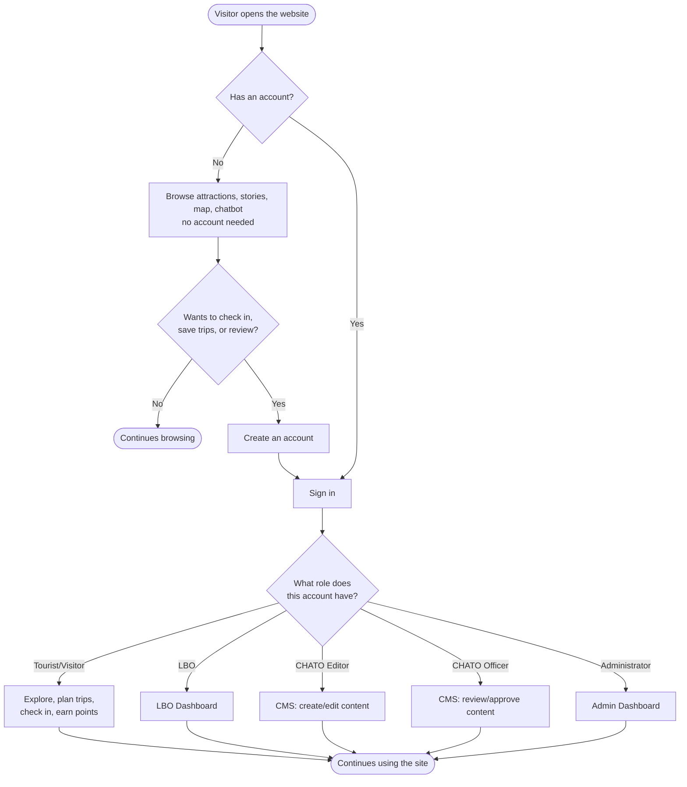
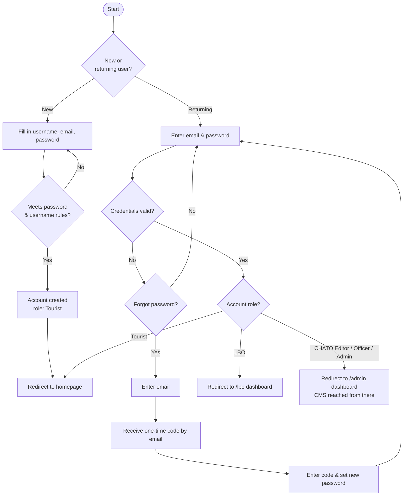
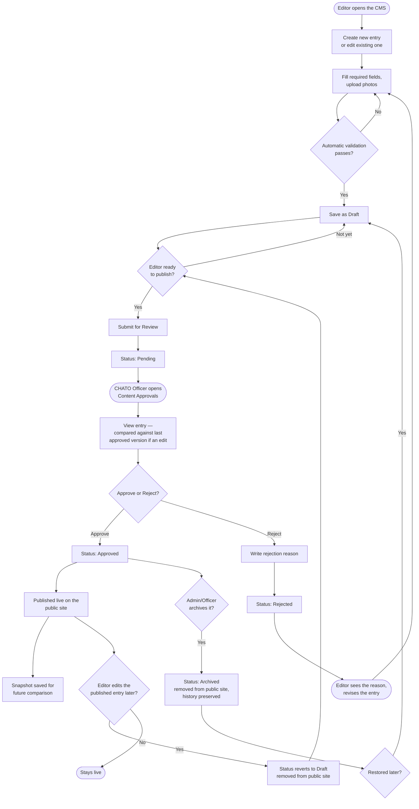
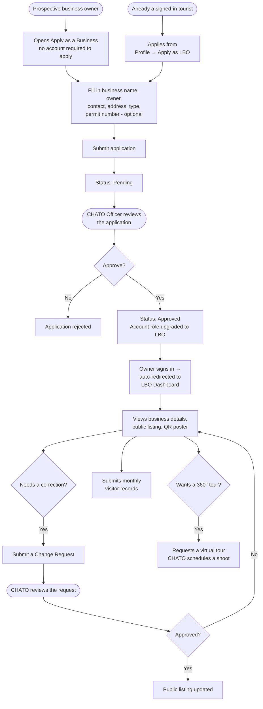
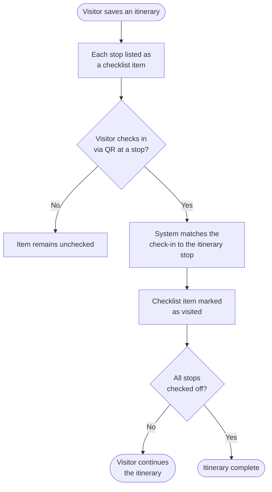
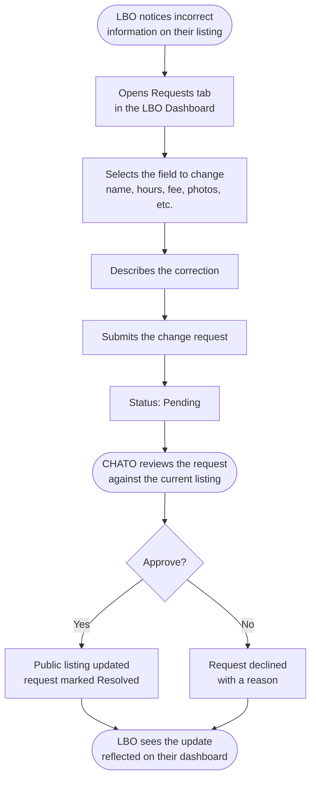
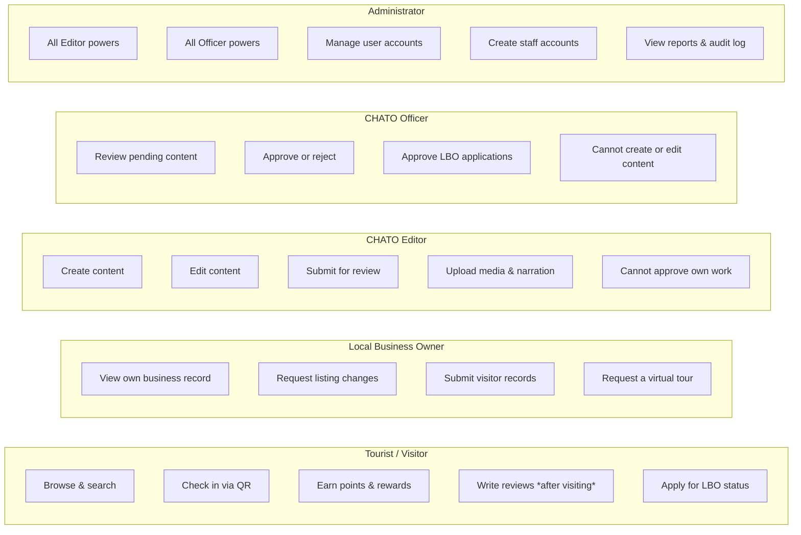

# Liliw Virtual Guide — System Flowcharts

*Visual process flows for the Liliw Virtual Guide platform. Diagrams are written in
Mermaid syntax and render automatically on GitHub and most Markdown viewers.*

---

## Table of Contents

1. [Overall System Flow](#1-overall-system-flow)
2. [Account Registration and Login](#2-account-registration-and-login)
3. [Content Publishing Workflow](#3-content-publishing-workflow)
4. [QR Check-In and Points Flow](#4-qr-check-in-and-points-flow)
5. [Business Owner (LBO) Application Flow](#5-business-owner-lbo-application-flow)
6. [AI Itinerary Planning Flow](#6-ai-itinerary-planning-flow)
7. [Itinerary Checklist Flow](#7-itinerary-checklist-flow)
8. [Content Change-Request Flow (LBO)](#8-content-change-request-flow-lbo)
9. [Role and Access Overview](#9-role-and-access-overview)

---

## 1. Overall System Flow

High-level view of how a visit to the system proceeds, from arrival to the major paths
available to each kind of user.



---

## 2. Account Registration and Login



---

## 3. Content Publishing Workflow

Applies uniformly to all nine content types (Attractions, Events, News, Art Forms,
Artisans, Stories, FAQs, Itineraries, Community Events). Authoring and publishing are
performed by different roles, and every state change is logged.



---

## 4. QR Check-In and Points Flow

```mermaid
flowchart TD
    A([Visitor arrives at a listed\nattraction or business]) --> B[Finds the printed\nQR poster at the entrance]
    B --> C[Opens Scan in the app\nand allows camera access]
    C --> D[Scans the QR code]
    D --> E{Signed in?}
    E -- No --> F[Prompted to sign in\nor create an account]
    F --> D

    E -- Yes --> G[System reads the visitor's\ncurrent location]
    G --> H{Within the required\ndistance of the attraction?}
    H -- No --> I[Check-in rejected:\n\"You must be at the location\"]
    H -- Yes --> J{Already checked in\nhere recently?}
    J -- Yes --> K[Duplicate check-in prevented]
    J -- No --> L[Visit recorded]

    L --> M[Points awarded]
    M --> N{Achievement\nthreshold reached?}
    N -- Yes --> O[Achievement unlocked\nand shown to the visitor]
    N -- No --> P[Continue]

    L --> Q{This place is on a\nsaved itinerary?}
    Q -- Yes --> R[Itinerary checklist\nitem automatically ticked]
    Q -- No --> P

    L --> S[Review form becomes\navailable for this place]
```

---

## 5. Business Owner (LBO) Application Flow



---

## 6. AI Itinerary Planning Flow

```mermaid
flowchart TD
    A([Visitor opens Itinerary\nand chooses "Plan with AI"]) --> B[Specifies trip length\nand interests]
    B --> C[Request sent to the\nAI planning service]
    C --> D[AI selects only from real,\npublished attractions,\ndining, and activities]
    D --> E{AI response\nvalid & complete?}
    E -- No --> F[Automatic retry with\nadjusted parameters]
    F --> D
    E -- Yes --> G[Day-by-day itinerary\ngenerated]

    G --> H[Road distances calculated\nbetween consecutive stops]
    H --> I{Routing service\navailable?}
    I -- Yes --> J[Road-accurate route drawn\non the map, one-way\nstreets respected]
    I -- No --> K[Straight-line distance shown\nas a fallback estimate]

    J --> L([Itinerary displayed\nwith map and schedule])
    K --> L

    L --> M{Visitor saves it?}
    M -- Yes --> N[Saved to profile\nbecomes a checklist]
    M -- No --> O([Itinerary remains\nunsaved])
```

---

## 7. Itinerary Checklist Flow

How a saved itinerary — AI-generated or curated — becomes a progress tracker.



---

## 8. Content Change-Request Flow (LBO)

How a business owner's requested correction reaches their public listing, without
letting them edit it directly.



---

## 9. Role and Access Overview

Summary of what each role can and cannot do across the content lifecycle — the
separation of duties that underlies §3 and §5.



---

*Liliw Virtual Guide — Culture, History, Arts and Tourism Office (CHATO), Municipality of Liliw, Laguna.*
