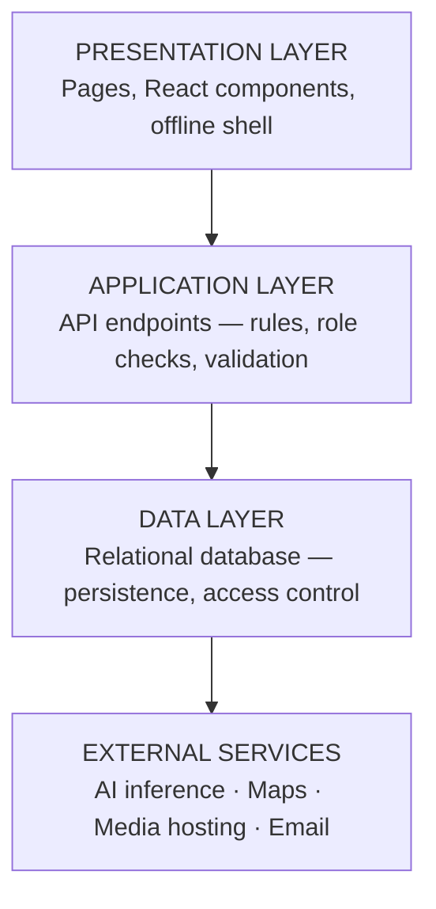
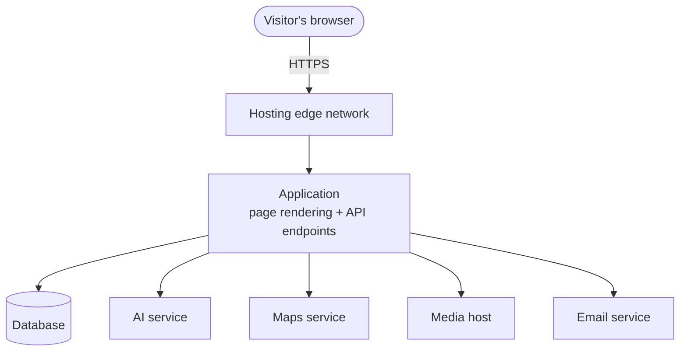

# Liliw Virtual Guide — System Manual

*Technical documentation for developers, system administrators, and the CHATO office IT custodian.*

---

## Table of Contents

1. [System Overview](#1-system-overview)
2. [System Requirements](#2-system-requirements)
3. [System Architecture](#3-system-architecture)
4. [Technology Stack](#4-technology-stack)
5. [Installation and Setup](#5-installation-and-setup)
6. [Environment Configuration](#6-environment-configuration)
7. [Module Descriptions](#7-module-descriptions)
8. [Database Design](#8-database-design)
9. [Security](#9-security)
10. [Deployment](#10-deployment)
11. [Maintenance Guide](#11-maintenance-guide)
12. [Known Limitations](#12-known-limitations)

---

## 1. System Overview

The Liliw Virtual Guide is a full-stack Progressive Web Application built with
**Next.js**, combining page rendering and server-side API logic in a single deployed
application rather than separate front-end and back-end projects. It serves both the
public tourism website and the internal tools (content management, business dashboard,
administration) that CHATO staff use to run it.

**Scale, as of the current build:**

| Measure | Count |
|---|---|
| Routed pages | 31 |
| Server API endpoints | 101 |
| React components | 65+ |
| Database tables | 40 |
| Schema migrations | 34 |
| Content types under editorial review | 9 |
| User roles | 5 |

---

## 2. System Requirements

### 2.1 Development Environment

| Resource | Requirement |
|---|---|
| Operating system | Any (Linux, macOS, Windows) |
| Runtime | Node.js 20 LTS or newer |
| Package manager | npm |
| Version control | Git |
| Editor | Any (Visual Studio Code used in development) |
| Browser | Any modern browser, for testing |

### 2.2 Deployment Environment

The system is designed to run on **managed, serverless infrastructure** rather than a
self-hosted server, so the tourism office does not need a systems administrator to keep
it running.

| Resource | Role |
|---|---|
| **Vercel** | Hosts the application: page rendering and all API endpoints, deployed automatically from the Git repository |
| **Managed PostgreSQL database** | Stores all application data (accounts, content, points, bookings, etc.), with row-level access control |
| **Cloudinary** | Hosts and optimizes images, video, and audio (narration recordings) |
| **Groq** | Hosted AI inference for the chatbot and itinerary planner |
| **Mapbox** | Maps, geocoding, and road-based routing |
| **SMTP (Gmail)** | Outgoing transactional email (verification codes, password resets, staff notifications) |

No physical server, and no on-premises database, needs to be maintained.

### 2.3 End-User Requirements

| Resource | Minimum |
|---|---|
| Device | Any smartphone, tablet, laptop, or desktop from roughly 2018 onward |
| Browser | Current version of Chrome, Edge, Firefox, or Safari |
| Connection | 3G or better; previously visited pages remain available offline |
| Optional permissions | Camera (for QR check-in), location (for proximity features) |

The interface degrades gracefully: the 3D storyteller falls back to a static
illustration on devices without WebGL support, and the site continues to function if
optional third-party services (maps, AI) are temporarily unavailable.

---

## 3. System Architecture

The application follows a layered architecture:



*A designed, printable version of this figure is in `docs/flowchart.html` (Figure 10).*

### 3.1 Request Flow



*A designed, printable version of this figure is in `docs/flowchart.html` (Figure 11).*

### 3.2 Design Principles

- **Authorization is enforced on the server, not just hidden in the interface.** Every
  action that changes data independently re-checks the caller's role before executing
  — a hidden button is not treated as a control.
- **One record, many features.** A single credited visit (from a QR check-in) is the
  one fact that unlocks a review, ticks an itinerary checklist item, and counts toward
  achievements — rather than each feature keeping its own copy of "did this person go
  there."
- **Graceful degradation.** If an external service (AI, maps, media) is unavailable,
  the affected feature falls back to a simpler behavior instead of breaking the page.
- **Shared rules live in one place.** Password policy, username rules, and content
  validation are each defined once and imported everywhere they're enforced, so the
  form and the server can never disagree about what's valid.

---

## 4. Technology Stack

### 4.1 Core Framework

| Technology | Purpose |
|---|---|
| **Next.js** (App Router) | Full-stack React framework — page rendering and API routes in one project |
| **React** | User interface library |
| **TypeScript** | Statically typed JavaScript, used throughout the codebase |
| **Tailwind CSS** | Utility-first styling |

### 4.2 Key Libraries

| Library | Purpose |
|---|---|
| Database client SDK | Talking to the database and its authentication service |
| Framer Motion | Animation and page transitions |
| three.js + React Three Fiber + drei | Rendering the 3D storyteller model |
| Mapbox GL / react-map-gl | Interactive maps and routing |
| AI SDK (Groq) | Chatbot and itinerary-planner inference |
| DOMPurify | Sanitizing rich-text content before it is displayed, to prevent script injection |
| Nodemailer | Sending transactional email |

### 4.3 Data and Services

| Service | Role |
|---|---|
| Managed PostgreSQL | Primary data store |
| Authentication service | Account creation, password hashing, session issuance |
| Cloudinary | Image, video, and audio hosting with automatic optimization |
| Groq | AI text generation |
| Mapbox | Maps, geocoding, and turn-by-turn-aware routing |
| Gmail SMTP | Email delivery |

### 4.4 Development Tools

| Tool | Purpose |
|---|---|
| Git / GitHub | Version control and source hosting |
| Vercel | Continuous deployment — every push to the main branch deploys automatically |
| ESLint | Static code analysis |
| TypeScript compiler | Type checking as part of every build |

---

## 5. Installation and Setup

### 5.1 Prerequisites

- Node.js 20 or newer installed
- A Git client
- Accounts/API keys for: the database provider, Cloudinary, Groq, Mapbox, and an SMTP
  mail sender (see §6)

### 5.2 Local Setup

```bash
# 1. Clone the repository
git clone <repository-url>
cd liliw-frontend

# 2. Install dependencies
npm install

# 3. Create the environment file
# Copy the variables listed in §6 into a file named .env.local

# 4. Run the development server
npm run dev
# The site is now available at http://localhost:3000
```

### 5.3 Building for Production

```bash
npm run build   # Compiles and type-checks the application
npm start       # Serves the production build locally
```

### 5.4 Database Setup

The database schema is defined as a sequence of numbered migration files (see
`supabase/` in the repository). Running them **in numeric order** against a fresh
database builds the complete schema, including all tables, constraints, and default
data. Each migration is written to be safely re-run without duplicating data or
breaking an existing installation.

---

## 6. Environment Configuration

The application is configured entirely through environment variables — no
configuration is hard-coded. The variables fall into these groups:

| Group | Purpose |
|---|---|
| **Database connection** | URL and keys for connecting to the database and its authentication service |
| **AI service** | API key and model name for the chatbot and itinerary planner |
| **Maps** | Public access token for Mapbox |
| **Media hosting** | Cloudinary account name and upload credentials |
| **Email** | SMTP account used to send verification codes and notifications |
| **Site identity** | The deployment's own public URL (used in emails and QR codes) |
| **Administration** | Email addresses granted administrator access on first sign-in |
| **Session security** | A secret key used to sign staff session cookies |
| **Optional services** | Search indexing and external review collection, disabled automatically if their keys are not set |

Variables prefixed `NEXT_PUBLIC_` are exposed to the browser (for client-side
features like maps); all other variables are server-only and never reach the browser.
The exact variable names are listed in `.env.local` on the development machine and in
the hosting provider's environment settings for production — they are intentionally
omitted from this manual since they include no useful information without their
accompanying secret values.

---

## 7. Module Descriptions

The system is organized into eight functional modules. Each owns its own set of
pages, API endpoints, and database tables, and modules interact only through the
database and a small set of shared libraries — not by calling into each other
directly.

### 7.1 Public Tourism Portal
Attraction, dining, footwear, accommodation, heritage, artisan, and news listings;
detail pages; site-wide search; the interactive map.

### 7.2 Content Management System (CMS)
Create, edit, submit, approve, reject, archive, and restore content across nine
content types, with role-based separation of authoring and publishing duties and a
full audit trail.

### 7.3 Business Owner (LBO) Portal
Business application and approval; a dashboard for the owner's business record, public
listing, and change requests; monthly visitor-record submission; a printable QR
check-in poster; virtual-tour requests.

### 7.4 Visitor Engagement
QR check-in, a points ledger, achievements, a rewards catalogue with redemption,
reviews gated on a credited visit, favorites, and saved trips.

### 7.5 AI Services
**Lilio**, a conversational assistant answering questions from the site's own content,
and an itinerary planner that generates a day plan from a visitor's stated interests
and available time, built only from real published places.

### 7.6 Itinerary and Mapping
Curated themed tours and AI-generated plans; road-accurate routing between stops
(respecting one-way streets); a checklist that ticks off stops as check-ins are
credited.

### 7.7 Immersive Media
360° virtual tours with hotspot navigation, and the rigged 3D storyteller with
bilingual audio narration on the Stories pages.

### 7.8 Administration and Analytics
User management and account deactivation, staff account creation, a unified inbox,
approval queues, and exportable reports on visits, submissions, and page views.

---

## 8. Database Design

The system uses a relational (PostgreSQL) database. Rather than reproducing raw table
definitions here, this section describes the data model conceptually, by area of
responsibility.

### 8.1 Data Groups

| Group | What it holds |
|---|---|
| **Identity** | User accounts, tourist profile details, avatar images |
| **Content** | The nine CMS content types (attractions, events, news, stories, art forms, artisans, FAQs, itineraries, community events) and their attached photos |
| **Business** | LBO applications, business change requests, listing requests, monthly visitor records |
| **Engagement** | Points ledger, achievements and unlocks, rewards and redemptions, QR check-ins, reviews, favorites, saved itineraries |
| **Participation** | Community event sign-ups, event registration forms and responses, feedback and inquiry submissions, newsletter subscriptions |
| **Operations** | Audit log, page-view analytics, live-session tracking, the staff inbox |

### 8.2 Design Decisions

**A single content lifecycle.** Every content type shares the same status progression
— *draft → pending → approved*, with *rejected* and *archived* as side states — so one
review workflow serves all nine content types instead of nine separate ones drifting
apart from each other.

**Media as its own table, linked by reference.** Photographs are stored as rows
referencing which content item they belong to, rather than as columns on each content
table. This means any content type can carry a photo gallery without a schema change,
and it's what lets the public Gallery page link every photo back to the exact listing
or story it came from.

**Points as an append-only ledger.** Each awarded action (a check-in, a share, etc.) is
recorded as its own row rather than the system maintaining a single running total. A
visitor's score is always the sum of their ledger, which keeps it auditable and lets
the same ledger answer more than one question — "has this person visited this place"
gates both the review form and the itinerary checklist.

**Content is archived, not deleted.** Removing content from public view retains its
row (and anything referencing it — reviews, check-ins, points) rather than deleting it
outright, so historical records stay meaningful.

**Row-level security.** Tables holding personal or business data enforce
row-level access rules at the database itself, as a second layer of protection beyond
the application's own role checks.

**Change snapshots.** When published content is edited, the system keeps a copy of the
content as it was at its last approval, so a reviewer can see exactly what changed in a
pending edit rather than only the final result.

---

## 9. Security

| Measure | Description |
|---|---|
| **Server-side authorization** | Every data-changing endpoint independently verifies the caller's role; the interface hiding a button is never the only protection |
| **Signed session cookies** | Staff sessions use an HttpOnly, cryptographically signed cookie that cannot be read or forged by client-side scripts |
| **Password policy** | Minimum 8 characters with uppercase, lowercase, numeric, and special-character requirements, enforced identically on the client and the server |
| **Content sanitization** | Rich text submitted through the CMS is sanitized before being rendered, removing scripts and unsafe attributes, to prevent stored cross-site-scripting |
| **Row-level security** | Database-level access rules on sensitive tables, independent of the application layer |
| **HTTPS everywhere** | All traffic between the browser and the server, and between the server and every external service, is encrypted |
| **Security headers** | Standard browser protections (clickjacking prevention, MIME-sniffing prevention, referrer policy, and a Content Security Policy) are applied to every response |
| **Rate-aware AI usage** | The AI integration handles provider rate limits and errors without exposing internal details to the visitor |
| **Least-privilege uploads** | Only Editors and Administrators can upload media; Officers, who publish content, cannot author it |

---

## 10. Deployment

### 10.1 Continuous Deployment

The production site is connected to the Git repository's main branch. Every commit
pushed to that branch triggers an automatic build and deployment; a failed build does
not replace the live site. Pull requests and feature branches can be previewed on
temporary URLs before merging.

### 10.2 Service Worker and Offline Support

The application registers a service worker that:

- Precaches the application shell, core narration audio, and images for offline use.
- Serves cached content when the network is unavailable.
- Notifies the visitor when a newer version has been deployed, with a **Reload**
  prompt, since the browser does not force an update while a tab is open.

### 10.3 Zero-Downtime Updates

Because deployment produces a new, complete build rather than patching the running
one, updates roll out without an outage; visitors mid-session continue on the version
they loaded until they reload.

---

## 11. Maintenance Guide

### 11.1 Adding a New Piece of Content

No code change is required — content is created entirely through the CMS by an Editor
and published by an Officer, following the workflow in the User Manual §5.

### 11.2 Adding a New Content *Type*

Extending the system with an entirely new kind of content (beyond the current nine)
requires a developer to: add a database table for it following the existing pattern,
register it in the shared content-type list, and add its form fields to the CMS. This
is a code change, not a content-authoring task.

### 11.3 Database Schema Changes

Schema changes are made as new, numbered migration files rather than editing existing
ones — this keeps the schema's history reproducible and lets any environment be brought
up to date by running the migrations it is missing, in order.

### 11.4 Rotating API Keys

Third-party credentials (database, AI, maps, media, email) can be rotated by updating
the corresponding environment variable in the hosting provider's settings and
redeploying — no code change is needed.

### 11.5 Monitoring

The Admin Dashboard's analytics section provides page-view counts and a live count of
active sessions. Build and deployment status is visible in the hosting provider's
dashboard. Errors in server endpoints are logged for later review.

---

## 12. Known Limitations

- The 3D storyteller's animations are limited to what is included in its exported
  model file; new gestures require a new export from the 3D authoring tool and cannot
  be added through the CMS.
- The system depends on third-party services (AI inference, maps, media hosting) for
  full functionality; each has a defined fallback, but the *best* experience requires
  all of them to be reachable and correctly configured.
- Editing already-published content returns it to draft status, requiring
  re-approval even for minor corrections — a deliberate safeguard, but one that means a
  typo fix is briefly offline.
- The offline mode caches pages and core assets but cannot perform actions that require
  a live connection (checking in, submitting a review, chatting with Lilio) while
  offline.

---

*Liliw Virtual Guide — Culture, History, Arts and Tourism Office (CHATO), Municipality of Liliw, Laguna.*
